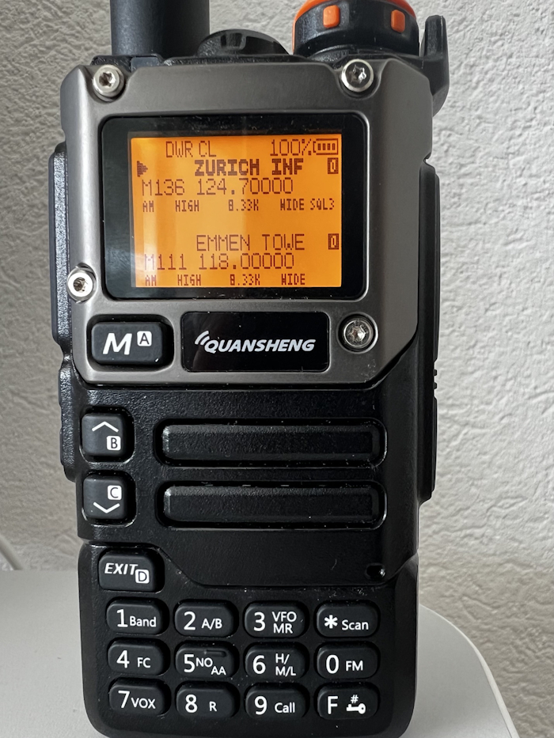

🌐 [English](README.md) | [Français](README.fr.md) | [Deutsch](README.de.md)

# chirp-atc
Fichiers CHIRP pour les fréquences ATC

Ce dépôt a pour but de générer des fichiers mémoire CHIRP à charger dans votre radio Quansheng.


<p align="center">
  
</p>


# Table des matières

- [CSV générés](#csv-générés)
    - [Tableau des zones](#tableau-des-zones)
- [get_frequencies.py](#get_frequenciespy)
    - [Fonctionnalités](#fonctionnalités)
    - [Installation](#installation)
    - [Utilisation](#utilisation)
        - [Arguments en ligne de commande](#arguments-en-ligne-de-commande)
    - [Exemples d'utilisation](#exemples-dutilisation)
    - [Attribution des données](#attribution-des-données)
    - [Licence](#licence)

# CSV générés

Les CSV générés sont disponibles dans l'onglet « Releases » de ce dépôt. Les fichiers sont générés une fois par jour.

Il y a un jeu par pays et un jeu par zone spécifique (voir [ci-dessous](#tableau-des-zones)).

Pour d'autres CSV, faites une pull-request ou ouvrez une issue.

## Tableau des zones

Étant donné que les anciens Quansheng ne peuvent gérer qu'environ 200 fréquences en mémoire, j'ai créé des listes plus petites, spécifiques à chaque zone.

Le tableau suivant représente les CSV spécifiques aux zones actuellement générés :

| Pays         | Nom de la zone          | Code postal | Rayon (km) | Ville de référence |
|--------------|-------------------------|-------------|------------|-------------------|
| Suisse       | Geneva-Leman            | 1200        | 50         | Genève            |
| Suisse       | Lausanne-Vaud           | 1000        | 50         | Lausanne          |
| Suisse       | Fribourg-Gruyère        | 1700        | 50         | Fribourg          |
| Suisse       | Neuchatel-Jura          | 2000        | 50         | Neuchâtel         |
| Suisse       | Bern-Capital            | 3000        | 50         | Berne             |
| Suisse       | Basel-North             | 4000        | 50         | Bâle              |
| Suisse       | Valais-Mountains        | 1950        | 50         | Sion              |
| Suisse       | Lucerne-Central         | 6000        | 50         | Lucerne           |
| Suisse       | Zurich-Metropolis       | 8001        | 50         | Zurich            |
| Suisse       | Ticino-South            | 6900        | 50         | Lugano            |
| France       | Île-de-France           | 45000       | 150        | Orléans           |
| France       | Normandie-Bretagne Est  | 50000       | 150        | Saint-Lô          |
| France       | Bretagne Ouest          | 29000       | 150        | Quimper           |
| France       | Pays de la Loire        | 49000       | 150        | Angers            |
| France       | Poitou-Charentes        | 86000       | 150        | Poitiers          |
| France       | Bordeaux-Aquitaine      | 33000       | 150        | Bordeaux          |
| France       | Midi-Pyrénées           | 31000       | 150        | Toulouse          |
| France       | Languedoc-Roussillon    | 34000       | 150        | Montpellier       |
| France       | Provence-Alpes-Côte d'Azur | 13000    | 150        | Marseille         |
| France       | Rhône-Alpes             | 69000       | 150        | Lyon              |
| France       | Bourgogne-Franche-Comté | 21000       | 150        | Dijon             |
| France       | Grand Est Ouest         | 54000       | 150        | Nancy             |
| France       | Grand Est Est           | 67000       | 150        | Strasbourg        |
| France       | Hauts-de-France Ouest   | 80000       | 150        | Amiens            |
| France       | Hauts-de-France Est     | 59000       | 150        | Lille             |
| Grande-Bretagne | London and South East | EC1A       | 150        | Londres           |
| Grande-Bretagne | Midlands              | B1         | 150        | Birmingham        |
| Grande-Bretagne | North West England    | M1         | 150        | Manchester        |
| Grande-Bretagne | Yorkshire and Humber  | LS1        | 150        | Leeds             |
| Grande-Bretagne | North East England    | NE1        | 150        | Newcastle upon Tyne |
| Grande-Bretagne | South West England    | BS1        | 150        | Bristol           |
| Grande-Bretagne | Wales                 | CF10       | 150        | Cardiff           |
| Grande-Bretagne | Scotland Central Belt | G1         | 150        | Glasgow           |
| Grande-Bretagne | Scotland North        | AB10       | 150        | Aberdeen          |
| Belgique      | Belgium               | 1000        | 100        | Bruxelles         |

# get_frequencies.py

`get_frequencies.py` est un outil en ligne de commande (CLI) conçu pour extraire les fréquences ATC depuis OpenAIP.

## Fonctionnalités

- Extrait les fréquences ATC d'OpenAIP en fonction d'un pays ou d'une région.
- Permet le filtrage par type de fréquence (aéroports, espaces aériens).
- Prend en charge la spécification d'un code postal et d'un rayon pour une zone géographique ciblée.
- Produit les données au format `CHIRP-CSV` ou `Console-JSON`.
- Prend en charge un mode débogage pour le dépannage.

## Installation

Pour utiliser `get_frequencies.py`, assurez-vous d'avoir Python 3.x installé sur votre système. Suivez ensuite les étapes ci-dessous :

1. Clonez le dépôt :

    ```bash
    git clone https://github.com/diaznet/chirp-atc.git
    cd chirp-atc
    git checkout
    ```

2. Installez les dépendances requises :

    ```bash
    pip install -r requirements.txt
    ```

3. Exécutez le script :

    ```bash
    python get_frequencies.py
    ```

## Utilisation

Vous pouvez exécuter le script avec la commande suivante :

```bash
python get_frequencies.py -h
```

Cela affichera les options disponibles :

```bash
usage: get_frequencies.py [-h] -c COUNTRY [COUNTRY ...] [-t TYPE [TYPE ...]] [-p POSTAL_CODE [POSTAL_CODE ...]] [-r RADIUS]
                          [-o {CHIRP-CSV,Console-JSON}] [-s SUFFIX] [-d]

Get frequencies for a specific country from openAIP.

options:
  -h, --help            show this help message and exit
  -c COUNTRY [COUNTRY ...], --country COUNTRY [COUNTRY ...]
                        ISO alpha-2 country codes.
  -t TYPE [TYPE ...], --type TYPE [TYPE ...]
                        Types of frequencies. Supported values are 'airports', 'airspaces'. Defaults to all.
  -p POSTAL_CODE [POSTAL_CODE ...], --postal-code POSTAL_CODE [POSTAL_CODE ...]
                        Postal code, to narrow down the output to a specific area.
  -r RADIUS, --radius RADIUS
                        Radius in kilometers around postal code, to narrow down the output to a specific area. Default is ().
  -o {CHIRP-CSV,Console-JSON}, --output {CHIRP-CSV,Console-JSON}
                        Output type. Default is Console-JSON.
  -s SUFFIX, --suffix SUFFIX
                        When writing a file, append the specified string to the filename.
  -d, --debug           Enable debug on STDERR.
```

### Arguments en ligne de commande

- `-c COUNTRY [COUNTRY ...], --country COUNTRY [COUNTRY ...]` : Spécifiez un ou plusieurs codes pays ISO alpha-2 (ex. : `CH`, `FR`).
- `-t TYPE [TYPE ...], --type TYPE [TYPE ...]` : Spécifiez le type de fréquences à récupérer. Options :
  - `airports`
  - `airspaces`
  - Par défaut : tous.
- `-p POSTAL_CODE [POSTAL_CODE ...], --postal-code POSTAL_CODE [POSTAL_CODE ...]` : Affinez les résultats en spécifiant un code postal.
- `-r RADIUS, --radius RADIUS` : Spécifiez le rayon (en kilomètres) autour d'un code postal. Par défaut : aucun rayon.
- `-o {CHIRP-CSV,Console-JSON}, --output {CHIRP-CSV,Console-JSON}` : Choisissez le format de sortie. Par défaut : `Console-JSON`.
- `-s SUFFIX, --suffix SUFFIX` : Ajoutez un suffixe au nom du fichier de sortie.
- `-d, --debug` : Activez le mode débogage (sortie sur STDERR).

## Exemples d'utilisation

1. **Obtenir les fréquences pour la Suisse (CH) :**

    ```bash
    python get_frequencies.py -c CH
    ```

2. **Obtenir les fréquences des aéroports en France (FR) et en Allemagne (DE) :**

    ```bash
    python get_frequencies.py -c FR DE -t airports
    ```

3. **Obtenir les fréquences dans un rayon de 50 km autour d'un code postal (ex. : 69000 à Lyon) :**

    ```bash
    python get_frequencies.py -c FR -p 69000 -r 50
    ```

4. **Exporter les fréquences au format CSV :**

    ```bash
    python get_frequencies.py -c CH -o CHIRP-CSV
    ```

## Espacement des canaux 8,33 kHz

La bande aéronautique européenne utilise un espacement de canaux de 8,33 kHz. Les fréquences publiées dans les AIP sont des **désignateurs de canaux**, pas des fréquences RF réelles. Cet outil convertit les désignateurs de canaux en fréquences centrales réelles selon le Doc 9718 de l'OACI.

Références :
- [OACI Doc 9718 Vol II - Tableau d'attribution des fréquences/canaux](https://www.icao.int/sites/default/files/FSMP/Doc.9718-Vol-II_Supplement_30June2017.pdf)
- [Ofcom - Understanding 8.33kHz frequencies and their specific channel number](https://www.ofcom.org.uk/siteassets/resources/documents/manage-your-licence/aeronautical/guidance/understanding-8.33khz-frequencies-and-their-specific-channel-number.pdf?v=323879)

## Attribution des données

Les données utilisées par `get_frequencies.py` proviennent d'OpenAIP. Si vous trouvez des informations incorrectes (fréquences ou noms erronés), nous vous encourageons à ouvrir une issue ou à le signaler directement à OpenAIP :

[OpenAIP RFC](https://www.openaip.net/)

Leur travail est inestimable et nous apprécions leurs contributions à la communauté aéronautique.

## Licence

Ce projet est sous licence MIT - consultez le fichier [LICENSE](LICENSE) pour plus de détails.
