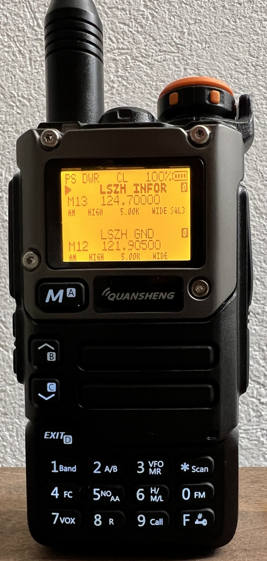

# chirp-atc
CHIRP files for ATC frequencies

This repository aims to generate CHIRP memory files to be loaded in your Quansheng radio.



# Generated CSVs

Generated CSVs are available in the release tab of this repository. The files are generated once a day.

There is a set per country, and a set per area (see [below](#areas-table)).

For more CSVs, pull-request or open an issue.

## Areas Table

The following table represents the currently generated CSVs:

| Country      | Area Name              | Postal Code | Radius (km) | Reference City |
|--------------|------------------------|-------------|-------------|----------------|
| Switzerland  | Geneva-Leman            | 1200        | 50          | Geneva         |
| Switzerland  | Lausanne-Vaud           | 1000        | 50          | Lausanne       |
| Switzerland  | Fribourg-Gruyère        | 1700        | 50          | Fribourg       |
| Switzerland  | Neuchatel-Jura          | 2000        | 50          | Neuchatel      |
| Switzerland  | Bern-Capital            | 3000        | 50          | Bern           |
| Switzerland  | Basel-North             | 4000        | 50          | Basel          |
| Switzerland  | Valais-Mountains        | 1950        | 50          | Sion           |
| Switzerland  | Lucerne-Central         | 6000        | 50          | Lucerne        |
| Switzerland  | Zurich-Metropolis       | 8001        | 50          | Zurich         |
| Switzerland  | Ticino-South            | 6900        | 50          | Lugano         |
| France       | Île-de-France           | 45000       | 150         | Orléans        |
| France       | Normandie-Bretagne Est  | 50000       | 150         | Saint-Lô       |
| France       | Bretagne Ouest          | 29000       | 150         | Quimper        |
| France       | Pays de la Loire        | 49000       | 150         | Angers         |
| France       | Poitou-Charentes        | 86000       | 150         | Poitiers       |
| France       | Bordeaux-Aquitaine      | 33000       | 150         | Bordeaux       |
| France       | Midi-Pyrénées           | 31000       | 150         | Toulouse       |
| France       | Languedoc-Roussillon    | 34000       | 150         | Montpellier    |
| France       | Provence-Alpes-Côte d'Azur | 13000     | 150         | Marseille      |
| France       | Rhône-Alpes             | 69000       | 150         | Lyon           |
| France       | Bourgogne-Franche-Comté | 21000       | 150         | Dijon          |
| France       | Grand Est Ouest         | 54000       | 150         | Nancy          |
| France       | Grand Est Est           | 67000       | 150         | Strasbourg     |
| France       | Hauts-de-France Ouest   | 80000       | 150         | Amiens         |
| France       | Hauts-de-France Est     | 59000       | 150         | Lille          |

# get_frequencies.py

`get_frequencies.py` is a Command Line Interface (CLI) tool designed to extract ATC frequencies from OpenAIP.

## Features

- Extracts ATC frequencies from OpenAIP based on a country or region.
- Allows filtering by frequency type (e.g., airports, airspaces).
- Supports specifying a postal code and radius for a targeted geographical area.
- Outputs data in either `CHIRP-CSV` or `Console-JSON` format.
- Supports debugging mode for troubleshooting.

## Installation

To use `get_frequencies.py`, ensure you have Python 3.x installed on your system. Then, follow the steps below to set up the project:

1. Clone the repository:

    ```bash
    git clone https://github.com/diaznet/chirp-atc.git
    cd chirp-atc
    git checkout
    ```

2. Install the required dependencies:

    ```bash
    pip install -r requirements.txt
    ```

3. Run the script:

    ```bash
    python get_frequencies.py
    ```

## Usage

You can run the script with the following command:

```bash
python get_frequencies.py -h
```

This will display the available options and usage:

```bash
usage: get_frequencies.py [-h] -c COUNTRY [COUNTRY ...] [-t TYPE [TYPE ...]] [-p POSTAL_CODE [POSTAL_CODE ...]] [-r RADIUS]
                          [-o {CHIRP-CSV,Console-JSON}] [-s SUFFIX] [-d]

Get frequencies for a specific country from openAIP.

options:
  -h, --help            show this help message and exit
  -c COUNTRY [COUNTRY ...], --country COUNTRY [COUNTRY ...]
                        ISO alpha-2 country codes.
  -t TYPE [TYPE ...], --type TYPE [TYPE ...]
                        Types of frequencies. Supported values are 'airports', 'airspaces'. Defaults to all.
  -p POSTAL_CODE [POSTAL_CODE ...], --postal-code POSTAL_CODE [POSTAL_CODE ...]
                        Postal code, to narrow down the output to a specific area.
  -r RADIUS, --radius RADIUS
                        Radius in kilometers around postal code, to narrow down the output to a specific area. Default is ().
  -o {CHIRP-CSV,Console-JSON}, --output {CHIRP-CSV,Console-JSON}
                        Output type. Default is Console-JSON.
  -s SUFFIX, --suffix SUFFIX
                        When writing a file, append the specified string to the filename.
  -d, --debug           Enable debug on STDERR.
```

### Command Line Arguments

- `-c COUNTRY [COUNTRY ...], --country COUNTRY [COUNTRY ...]`: Specify one or more ISO alpha-2 country codes (e.g., `US`, `DE`).
- `-t TYPE [TYPE ...], --type TYPE [TYPE ...]`: Specify the type of frequencies you want to retrieve. Options are:
  - `airports`
  - `airspaces`
  - Default is all.
- `-p POSTAL_CODE [POSTAL_CODE ...], --postal-code POSTAL_CODE [POSTAL_CODE ...]`: Narrow down the results by specifying a postal code.
- `-r RADIUS, --radius RADIUS`: Specify the radius (in kilometers) around a postal code to narrow down the results. Default is no radius.
- `-o {CHIRP-CSV,Console-JSON}, --output {CHIRP-CSV,Console-JSON}`: Choose the output format. Default is `Console-JSON`.
- `-s SUFFIX, --suffix SUFFIX`: Append a suffix to the output filename when writing to a file.
- `-d, --debug`: Enable debug mode to output debug information to STDERR.

## Example Usage

1. **Get frequencies for the United States (US):**

    ```bash
    python get_frequencies.py -c US
    ```

2. **Get frequencies for airports in Germany (DE) and the United States (US):**

    ```bash
    python get_frequencies.py -c US DE -t airports
    ```

3. **Get frequencies within a 50 km radius of a specific postal code (e.g., 10115 in Germany):**

    ```bash
    python get_frequencies.py -c DE -p 10115 -r 50
    ```

4. **Output frequencies in CSV format:**

    ```bash
    python get_frequencies.py -c US -o CHIRP-CSV
    ```

## Data Attribution

The data used by `get_frequencies.py` is sourced from OpenAIP. If you find any incorrect information (such as inaccurate frequency data or naming), we encourage you to open an issue or report it directly to OpenAIP:

[OpenAIP RFC](https://www.openaip.net/)

Their work is invaluable, and we appreciate their contributions to the aviation community.

## License

This project is licensed under the MIT License - see the [LICENSE](LICENSE) file for details.
